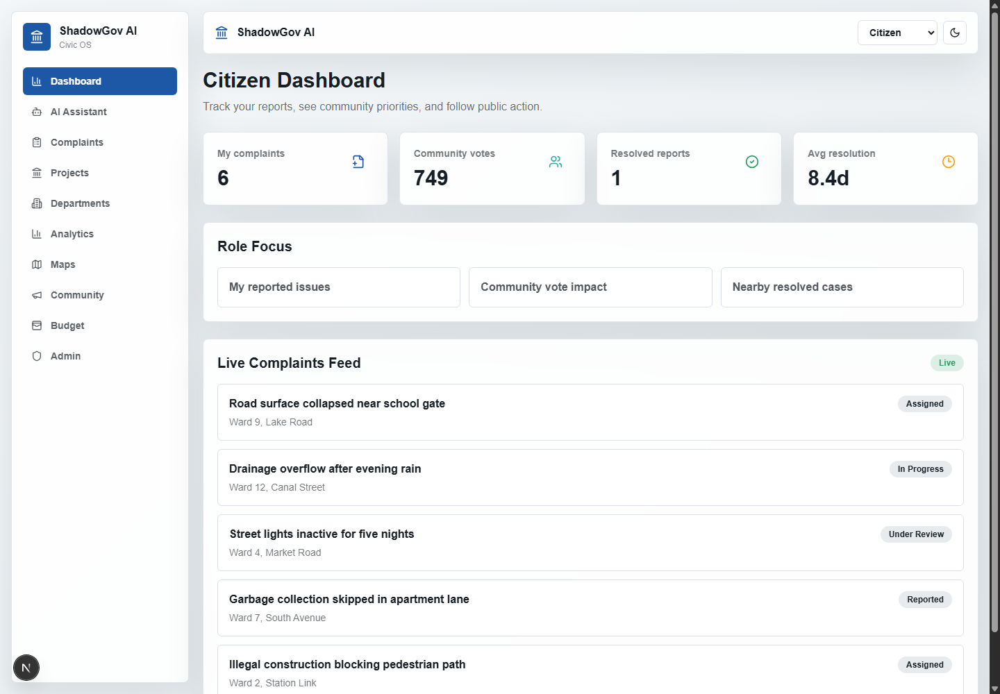
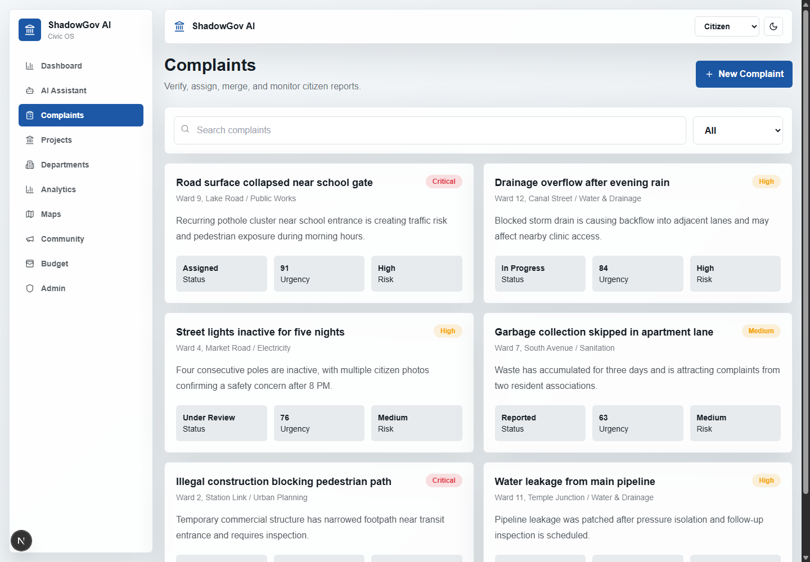
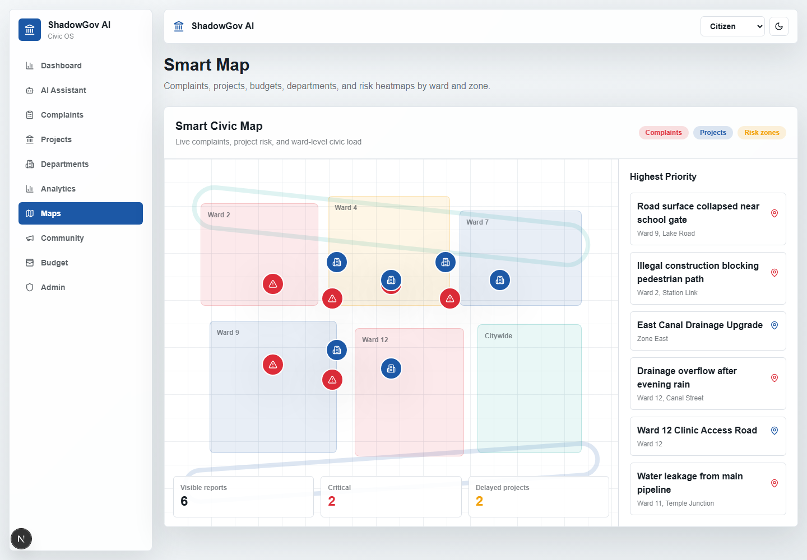
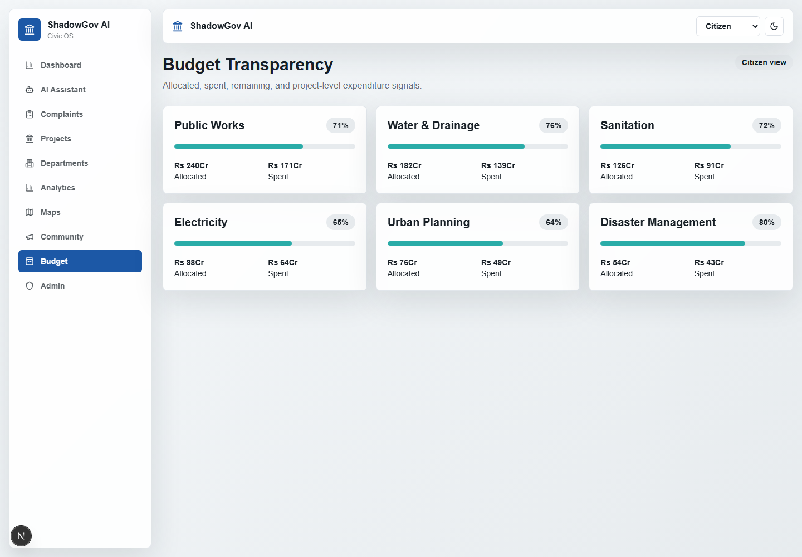
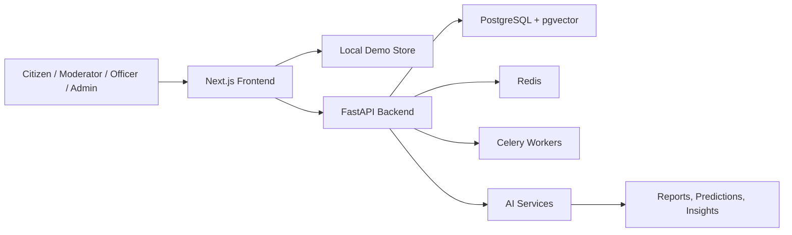
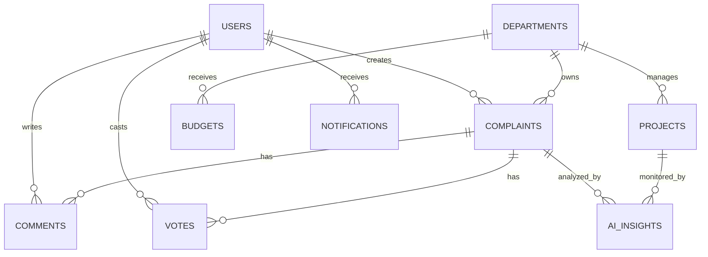

# ShadowGov AI

ShadowGov AI is an AI-powered civic transparency dashboard for citizens, moderators, officers, and admins. It helps track public complaints, government projects, budgets, departments, civic maps, analytics, and AI-assisted civic insights from one clean interface.

The current demo app is built so it can run quickly on a local machine. The frontend uses local role switching and browser storage so you can test workflows immediately without setting up authentication first.

## Screenshots

### Dashboard



### Complaints



### Smart Map



### Budget



## Main Features

- Role-based dashboard views for Citizen, Moderator, Officer, and Admin
- Citizen complaint creation with instant reflection in the complaints board
- Complaint filtering by status and search text
- Officer project creation from the Projects page
- Officer budget creation and editing from the Budget page
- Live civic map with ward zones, complaint pins, project pins, risk zones, and priority summaries
- Project monitoring table with progress, budget, status, and risk scoring
- Department performance overview
- Analytics charts for complaint trends and department load
- AI assistant page for civic questions and summaries
- Dark mode toggle
- Responsive UI for desktop and mobile

## Tech Stack

### Frontend

- Next.js 15
- React 19
- TypeScript
- Tailwind CSS
- Zustand for local persisted state
- React Query
- Recharts
- Lucide React icons

### Backend

- FastAPI
- SQLAlchemy
- Pydantic settings
- Redis and Celery-ready structure
- OpenAI service boundary
- PostgreSQL/pgvector-ready Docker setup

## Project Structure

```text
ShadowGov AI/
  backend/
    app/
      core/
      db/
      services/
      main.py
      models.py
      schemas.py
    requirements.txt
    seed.py
  frontend/
    app/
      dashboard/
      complaints/
      projects/
      budget/
      maps/
    components/
    lib/
    package.json
  docker-compose.yml
  README.md
```

## How To Download On Your Local Machine

You need Git, Node.js, and Python installed.

### 1. Install Required Software

Install these first:

- Git: https://git-scm.com/downloads
- Node.js LTS: https://nodejs.org
- Python 3.11 or newer: https://www.python.org/downloads

After installing, open a terminal and check:

```bash
git --version
node --version
npm --version
python --version
```

### 2. Download The Project

Use this command:

```bash
git clone git@github.com:abhijha8287/shadowgov-ai.git
```

Then open the folder:

```bash
cd shadowgov-ai
```

If SSH is not set up on your computer, download the ZIP from GitHub instead:

1. Open the GitHub repository in your browser.
2. Click `Code`.
3. Click `Download ZIP`.
4. Extract the ZIP.
5. Open the extracted folder in VS Code or terminal.

## Run The Frontend

The frontend is the main UI.

```bash
cd frontend
npm install
npm run dev
```

Open this in your browser:

```text
http://localhost:3000
```

If port `3000` is busy, run:

```bash
npm run dev -- --port 3001
```

Then open:

```text
http://localhost:3001
```

## Run The Backend

Open a second terminal from the project root.

```bash
cd backend
python -m venv .venv
.venv\Scripts\activate
pip install -r requirements.txt
python -m uvicorn app.main:app --reload --port 8000
```

Open the backend API docs:

```text
http://localhost:8000/docs
```

On macOS/Linux, activate the virtual environment with:

```bash
source .venv/bin/activate
```

## Run With Docker

If you have Docker installed, you can start the full stack with:

```bash
docker compose up --build
```

This is useful when you want PostgreSQL, Redis, backend, and frontend services running together.

## How To Use The App

### Change User Role

Use the role dropdown in the top-right header.

Available roles:

- Citizen
- Moderator
- Officer
- Admin

Each role shows a different dashboard focus.

### Citizen

Citizens can:

- View their civic dashboard
- Create complaints
- Track complaint status
- View community reports
- Explore the civic map

### Moderator

Moderators can:

- Review reported complaints
- Focus on unverified and under-review reports
- Watch escalation candidates

### Officer

Officers can:

- Add new government projects
- Add new department budgets
- Edit existing budget allocation and spending
- Monitor assigned and high-risk work

### Admin

Admins can:

- See citywide performance
- Monitor departments
- Review projects, budgets, and analytics
- View system-level accountability signals

## Important Pages

```text
/dashboard       Role-based dashboard
/complaints      Complaint board
/complaints/new  Add a new complaint
/projects        Project monitoring and officer project creation
/budget          Budget transparency and officer budget editing
/maps            Smart civic map
/departments     Department leaderboard
/analytics       Charts and trends
/assistant       AI civic assistant
/admin           Admin overview
```

## Local Data Behavior

This demo uses browser storage through Zustand persistence.

That means:

- New complaints appear immediately in the complaints section.
- New officer projects appear immediately in the projects table.
- Budget edits appear immediately in the budget cards.
- Data can remain after refreshing the browser.

To reset local demo data, clear the browser site storage for `localhost`.

## API Highlights

The backend includes these API boundaries:

- `GET /health`
- `GET /api/complaints`
- `POST /api/complaints`
- `GET /api/projects`
- `GET /api/departments`
- `GET /api/analytics/overview`
- `POST /api/assistant/query`

## Environment Variables

Copy the example env file:

```bash
copy .env.example .env
```

On macOS/Linux:

```bash
cp .env.example .env
```

Then fill in real secrets only when you are connecting production services.

For local UI testing, the frontend can run without production secrets.

## Common Problems And Simple Fixes

### CSS Is Not Loading

Stop the dev server, delete the frontend build cache, and run it again:

```bash
cd frontend
rmdir /s /q .next
npm run dev
```

On macOS/Linux:

```bash
rm -rf .next
npm run dev
```

### Port 3000 Is Already Busy

Use another port:

```bash
npm run dev -- --port 3001
```

### PowerShell Blocks npm

Use `npm.cmd` instead:

```bash
npm.cmd run dev
```

### Backend Virtual Environment Does Not Activate

On Windows PowerShell, run:

```bash
Set-ExecutionPolicy -Scope Process -ExecutionPolicy Bypass
.venv\Scripts\activate
```

## Build For Production

From the frontend folder:

```bash
npm run build
npm run start
```

## Architecture



## Data Model Overview



## GitHub Push Commands

If this is a fresh local folder, use:

```bash
git init
git add .
git commit -m "Initial ShadowGov AI app"
git remote add origin git@github.com:abhijha8287/shadowgov-ai.git
git branch -M master
git push -u origin master
```

If the remote already exists, use:

```bash
git remote set-url origin git@github.com:abhijha8287/shadowgov-ai.git
git branch -M master
git push -u origin master
```
